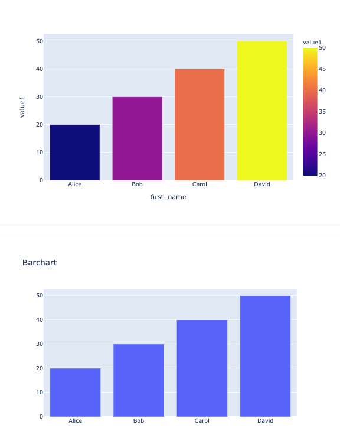

## Django demo for tracking patients and visits

A Django demo for loading patients and visits from a SQL database using the Django ORM.
Patients and visits are displayed in tables.

Figure 1: Table of patients and visits

Figure 2: Barcharts created with plotly

