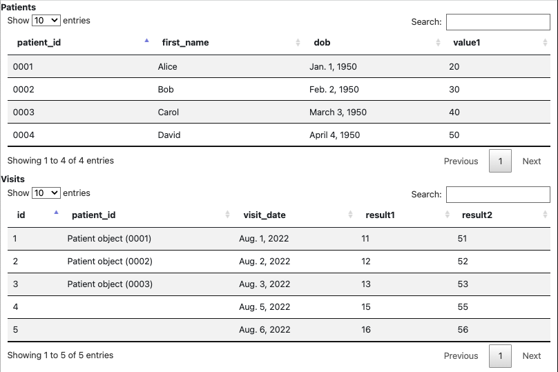

## Django demo for tracking patients and visits

A Django demo for loading patients and visits from a SQL database using the Django ORM. This demo uses data tables, barcharts and unit tests.

### Data Tables
Patients and visits are displayed in data tables.


### Barcharts
Barcharts created with plotly.


### Unit Tests
Run unit tests for models.
```console
python manage.py test --keepdb test_app_01.test_models
```

Run unit tests for views.
```console
python manage.py test --keepdb test_app_01.test_views
```
